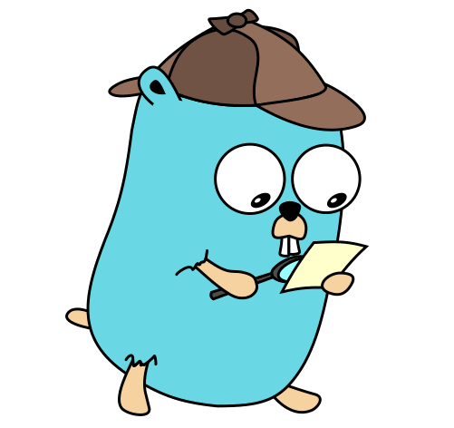

<div align="center">

  
  <h3 align="center">cryptodatapi-go-sdk</h3>
  <p align="center"><a href="https://moatsystems.com/crypto-api/">Crypto API</a> SDK for Golang. 🦠 </p>

[](https://github.com/moatsystems/cryptodatapi-go-sdk/releases/latest)
[](https://goreportcard.com/report/github.com/moatsystems/cryptodatapi-go-sdk)
[](https://pkg.go.dev/github.com/moatsystems/cryptodatapi-go-sdk)
[](/LICENSE)

</div>

---

### Getting Started
 
```golang
import "github.com/moatsystems/cryptodatapi-go-sdk"
```

#### Dependence

- [simplejson](https://github.com/bitly/go-simplejson)
- [resty](https://github.com/go-resty/resty)


#### Testing

Run the following command to test the package.

```sh
USER=<username> PASS=<password> go test -v
```

#### Implementation

```golang
c: = client.New()
token,ok := c.Auth("<username>", "<password>")

// For example, call an endpoint such as LivePrice
live_price := c.LivePrice()
  
// Retrieve All LivePrice Data
j, err := live_price.GetAll()

// Retrieve LivePrice Data By ID
j, err := live_price.GetById("<id>")

// Retrieve LivePrice Data By Symbol
j, err := live_price.GetBySymbol("<symbol>")

// Get API result (see simplejson)
j.Get("Code").String()
j.Get("Message").String()
j.Get("Document").Array()
```

Below are all the available endpoints.

```sh
c.LivePrice()
c.TopGainers()
c.TopLosers()
c.History(2021)
c.History(2022)
c.Derivatives()
c.Dex()
c.Lending()
c.Spot()
c.News()
```

All the endpoints listed above have five methods.

```sh
- GetAll()
- GetById(id int)
- Create(data map[string]interface{})
- UpdateById(id int, data map[string]interface{})
- DeleteById(id int)
```


#### License

This project is licensed under the [BSD 3-Clause License](LICENSE) - see the file for details.


#### Copyright

(c) 2020 - 2022 [Moat Systems Limited](https://moatsystems.com).